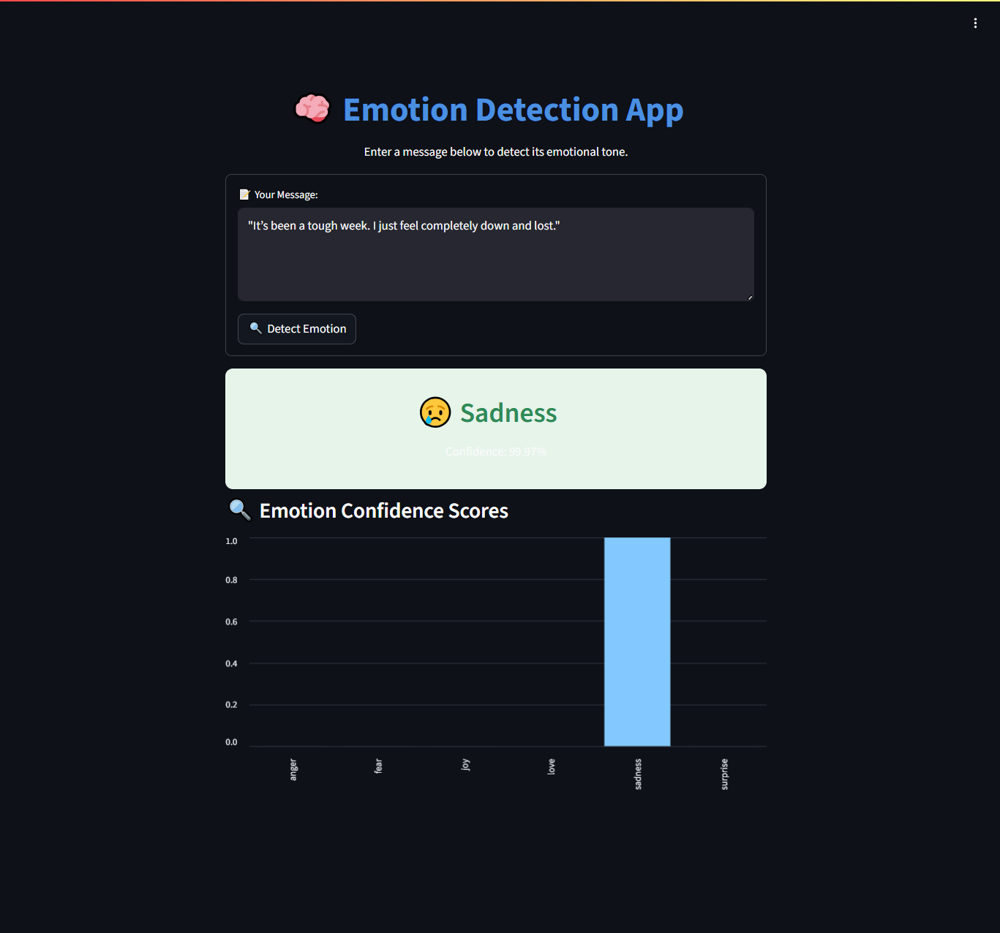

# 😄 Emotion Detection App – NLP Powered by BERT

A smart web app that detects human emotions from text input using a fine-tuned **BERT** model. Supports 6 emotions: **Happy, Sad, Angry, Fear, Surprise, and Neutral**. The output includes both the predicted emotion **and an emoji** for an engaging user experience 🎯

---

## 🔍 Features

- 🧠 **Natural Language Understanding (NLU)**
- 🎭 **Emotion Classification** using Hugging Face Transformers
- ✨ **Emoji-based Output** for friendly UX
- 🌐 **Streamlit Web App** with interactive UI
- 📁 **Pre-trained model included** with Git LFS

---

## 📊 Dataset

- **Source:** [Crowdflower Emotion Dataset](https://www.figure-eight.com/data-for-everyone/)
- **Classes:** `Happy`, `Sad`, `Angry`, `Fear`, `Surprise`, `Neutral`
- **Processing:** Cleaned, tokenized, and split into train/test for model fine-tuning

---

## 🛠 Tech Stack

| Component      | Tool/Library                      |
|----------------|-----------------------------------|
| Language       | Python                            |
| NLP Model      | BERT via Hugging Face Transformers|
| Model Training | Scikit-learn, Pandas              |
| Interface      | Streamlit                         |
| Visualization  | Emoji, Streamlit                  |
| Model Storage  | Git LFS                           |

---

## 🚀 Live Demo

▶️ Try the app live on Hugging Face Spaces:  
🔗 **[Launch Emotion Detector Web App](https://huggingface.co/spaces/sickboi25/emotion-detection-app)**

---

## 🖼 App Preview



---

## ⚙️ Run Locally

> Requires Python 3.9+

```bash
git clone https://github.com/MAhsaanUllah/Emotion_Detection_App.git
cd Emotion_Detection_App
pip install -r requirements.txt
streamlit run app.py

🧠 Model Files
Model files are located in:

bash
Copy
Edit
streamlit_emotion_app/emotion_model/
Tracked via Git LFS:

model.safetensors (BERT weights)

tokenizer.json, vocab.txt, config.json, etc.

👉 Ensure Git LFS is installed and initialized before cloning or pushing model files.

📌 Future Improvements
🎤 Add voice-to-text input

🌍 Add multilingual emotion detection (Urdu, Hindi, etc.)

📊 Display bar chart of prediction probabilities

📦 Convert to a Python package or Hugging Face model hub upload

🙋‍♂️ Author
Muhammad Ahsaan Ullah
📧 LinkedIn:  https://www.linkedin.com/in/muhammad-ahsaan-ullah-profile/
🧠 GitHub:  https://github.com/MAhsaanUllah


