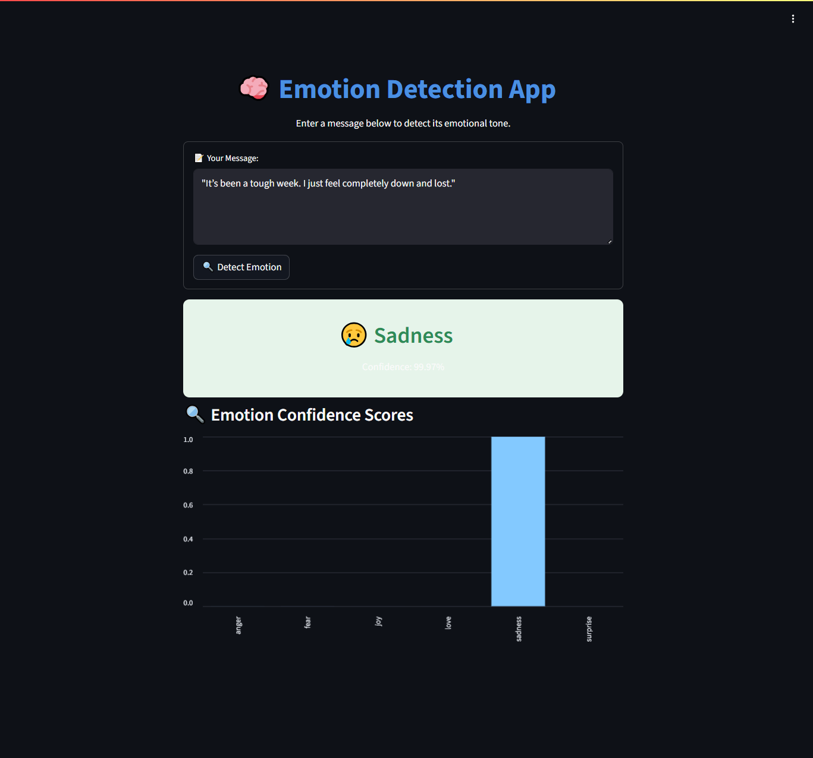

# 😄 Emotion Detection App – NLP Powered by BERT  

An AI-powered web app that detects **human emotions from text** in real time using a fine-tuned **BERT model**.  

This project demonstrates my ability to build **end-to-end AI solutions**:  
- Cleaning and preparing raw data  
- Fine-tuning transformer models (BERT)  
- Deploying an interactive web app for real users  

It highlights practical applications of NLP in **customer experience, feedback analysis, and digital engagement.**  

---

## 🔍 Why This Project Matters  

- **Business Value:** Helps companies understand customer tone, detect dissatisfaction early, and personalize interactions.  
- **Innovation:** Goes beyond simple positive/negative sentiment by detecting six nuanced emotions.  
- **Recruiter Insight:** Shows practical skills in **Python, NLP, ML model fine-tuning, deployment, and visualization.**  

---

## 🎯 Key Features  

- 🧠 **Emotion Classification** → Predicts 6 emotions: *Happy, Sad, Angry, Fear, Surprise, Neutral*  
- 🎭 **Emoji-based Output** → Makes results intuitive and user-friendly  
- 🌐 **Web App** → Built with **Streamlit** for interactive use  
- 📊 **Pre-trained Model** → Fine-tuned and ready for production-scale text analysis  

---

## 📊 Dataset  

- **Source:** [Crowdflower Emotion Dataset](https://www.figure-eight.com/data-for-everyone/)  
- **Classes:** `Happy`, `Sad`, `Angry`, `Fear`, `Surprise`, `Neutral`  
- **Preprocessing:** Cleaned, tokenized, and split into training/testing for BERT fine-tuning  

---

## 🛠 Tech Stack  

| Component      | Tool/Library                      |
|----------------|-----------------------------------|
| Language       | Python                            |
| NLP Model      | BERT (Hugging Face Transformers)  |
| Training       | Scikit-learn, Pandas              |
| Interface      | Streamlit                         |
| Deployment     | Hugging Face Spaces               |
| Storage        | Git LFS                           |

---

## 🚀 Live Demo  

🔗 **[Launch the App on Hugging Face Spaces](https://huggingface.co/spaces/sickboi25/emotion-detection-app)**  

---

## 🖼 Preview  

  

---

## ⚙️ Run Locally  

> Requires Python 3.9+  

```bash
git clone https://github.com/MAhsaanUllah/Emotion_Detection_App.git
cd Emotion_Detection_App
pip install -r requirements.txt
streamlit run app.py


📂 Model files are stored in streamlit_emotion_app/emotion_model/ (tracked with Git LFS).

📌 Future Enhancements

🎤 Add voice-to-text input

🌍 Extend to multilingual emotion detection (Urdu, Hindi, etc.)

📊 Visualize probability distributions of predictions

📦 Package into a reusable Python library

👤 Author

Muhammad Ahsaan Ullah

🔗 LinkedIn

💻 GitHub

✨ Recruiter Note: This project demonstrates applied expertise in NLP, ML model development, evaluation metrics, and real-world deployment — skills directly relevant to Data Science, AI, and ML internships.
